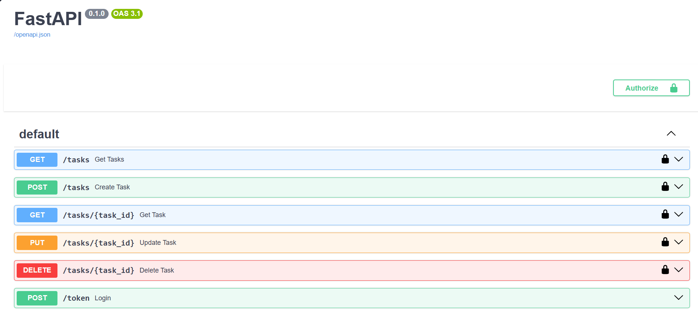
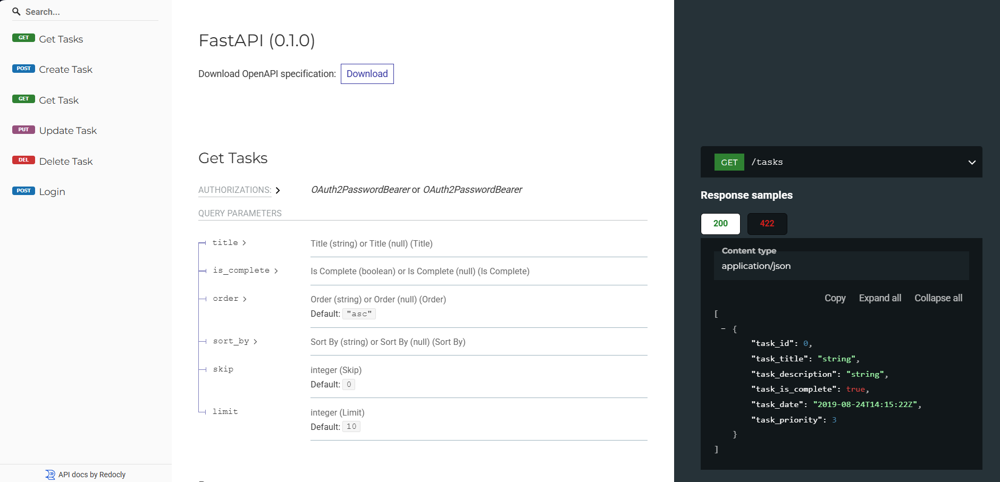
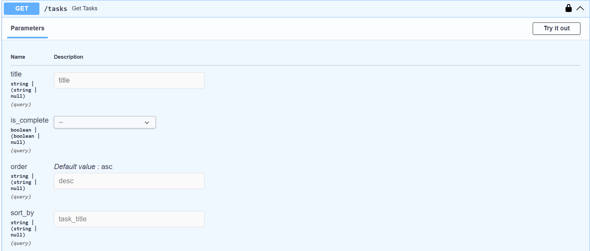
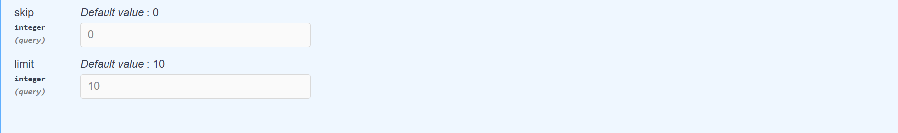
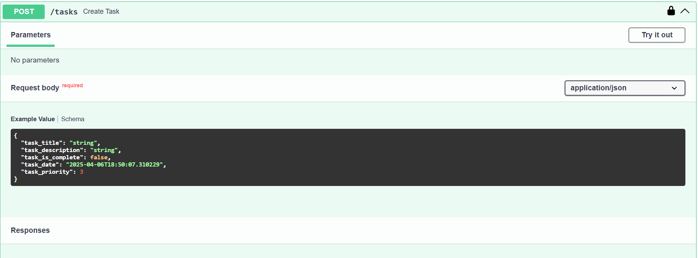
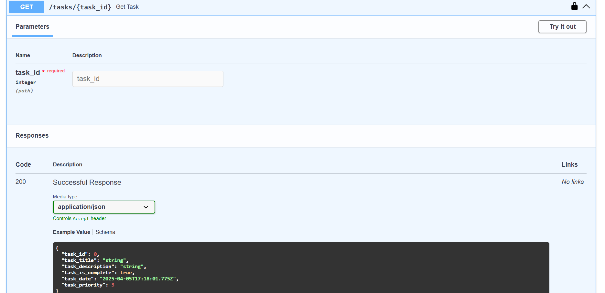
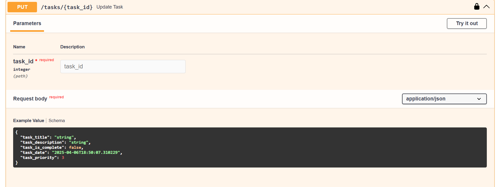
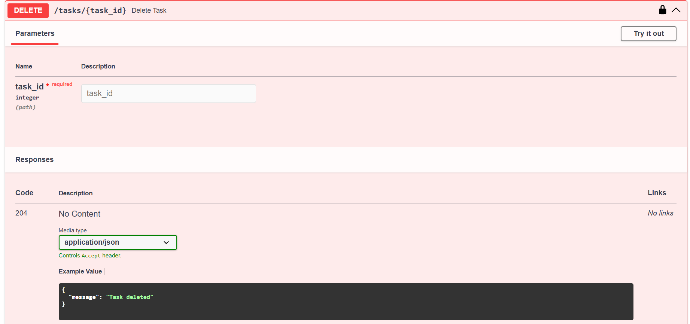

# To-Do List API

A simple and efficient REST API for managing tasks, built with FastAPI and SQLAlchemy. This project supports JWT authentication and full CRUD operations, allowing users to create, update, read, and delete tasks.

## Features

- **CRUD operations:** Create, read, update, and delete tasks.
- **JWT Authentication:** Secure endpoints that require authentication.
- **Automatic API documentation:** Swagger UI is automatically generated and available at `/docs` and ReDoc at `/redoc`.
- **Transaction rollback in tests:** Changes made during tests are rolled back, ensuring a clean database state.


## Technologies

- **Python 3.11**
- **FastAPI** – for building the REST API
- **SQLAlchemy** – for ORM and database interaction
-  **MySQL** – as the primary database (managed via MySQL Workbench)
- **JWT** – for authentication
- **Pytest** – for unit and integration testing

## Installation

### Prerequisites

- Python 3.11 installed
- Git installed

### Steps

1. **Clone the repository:**

   ```bash
   git clone https://github.com/xClaudi/to-do-list-api.git
   cd to-do-list-api
    ```

2. **Create and activate a virtual environment:**

   - **On Windows:**

     ```bash
     python -m venv myenv
     myenv\Scripts\activate
     ```

   - **On macOS/Linux:**

     ```bash
     python3 -m venv myenv
     source myenv/bin/activate
     ```

3. **Install dependencies:**

   ```bash
   pip install -r requirements.txt
	 ```


4. **Create databases:**

Before running the app, you must manually create **two empty databases** in MySQL:

####  Example using MySQL CLI:
```sql
CREATE DATABASE task;
CREATE DATABASE test;
```


5. **Configure environment variables:**

Make a copy of `.env.example` and rename it to `.env`, then fill in your own values. For example:

   ```ini
   MYSQL_HOST=localhost
   MYSQL_USER=root
   MYSQL_PASSWORD=password
   MYSQL_DATABASE=task
   MYSQL_TEST_DATABASE=test
   SECRET_KEY=your-unique-secret-key
   ```


#### Generating a secure `SECRET_KEY` (recommended):
Instead of typing a random string manually, **generate a secure key** using Python:

   ```bash
python -c "import secrets; print(secrets.token_urlsafe(256))"
```

Copy the generated string and paste it as the value for `SECRET_KEY` in your `.env` file.

> **Why this matters:**  
> `SECRET_KEY` is used to sign JWT tokens. If it’s too short, predictable, or reused across environments, it could lead to security vulnerabilities. Make sure to use a **long, random, and unique** key and never expose it publicly.

 6. **Run database migrations:**

This app uses **Alembic** for migrations. After configuring your `.env` file, apply all migrations to initialize the `task` database schema:

 ```bash
alembic upgrade head
```

7.  **Insert default users (for login):**
    

In the `task` database, manually insert default users for login/authentication. Example using SQL:


```sql
USE task;
INSERT INTO users (users_username, users_hashed_password)
VALUES ('test', 'secret'), ('user', 'password');
```
**Note**: These are pre-set plain text passwords used only for testing/development. In production, store hashed passwords securely.


8. **Run the application:**


  ```bash
 uvicorn main:app --reload 
```
The API will be accessible at [http://localhost:8000](http://localhost:8000).


## Running with Docker (optional)

1.  **Make sure `.env` is in your project root.**
2.  **Update your .env file (Windows/Mac users):**
If you're running MySQL outside of Docker (e.g. locally installed), and using Docker on Windows or macOS, change the host to:
```env
MYSQL_HOST=host.docker.internal
```
> **On Linux, you can usually keep localhost.:**
    
3.  **Build the Docker image:**
```bash
docker build -t todo-api .
```
4.  **Run the container with `.env`:**
   
On Windows:
```bash
docker run --env-file .env -p 8000:8000 todo-api
```
On Linux:
```bash
docker run --env-file .env --network="host" todo-api
```
This runs the app on [http://localhost:8000](http://localhost:8000), reading your MySQL credentials from `.env`.

> **Note on testing inside Docker:**  
> Tests are not automatically executed when running the container. If you want to run tests inside the Docker container, you can do so with:
> 
> ```bash
> docker run --env-file .env todo-api pytest -v
> ```
> 
> However, it's generally easier to run tests locally using your virtual environment

## Testing

The project uses Pytest and FastAPI TestClient for testing. To run tests, ensure your virtual environment is active and run:


```bash
pytest -v
```


The tests are configured to use a separate test database session with transaction rollback, so any changes made during tests are not persisted.

## Usage

### API Documentation

FastAPI automatically generates interactive API documentation:

-   **Swagger UI:** [http://localhost:8000/docs](http://localhost:8000/docs)
    
-   **ReDoc:** [http://localhost:8000/redoc](http://localhost:8000/redoc)
    

### Example Request

**Create a Task**


  ```http
POST /tasks HTTP/1.1
Host: localhost:8000
Content-Type: application/json
Authorization: Bearer <your-token>

{
  "task_title": "Buy groceries",
  "task_description": "Milk, bread, eggs",
  "task_is_complete": false,
  "task_date": "2025-04-05T10:00:00",
  "task_priority": 2
}
```

**Response:**

```json
{  "task_id":  1,  "task_title":  "Buy groceries",  "task_description":  "Milk, bread, eggs",  "task_is_complete":  false,  "task_date":  "2025-04-05T10:00:00",  "task_priority":  2  }
```

### Authentication

For endpoints requiring authentication, include the following header:

```makefile
Authorization: Bearer <your-token>
```


## Screenshots

### Swagger UI Overview

Below is the main Swagger UI page, displaying all available endpoints in the API:



### ReDoc Documentation

Below is the main ReDoc interface, showing the list of endpoints on the left and the details of the selected endpoint (including parameters and response samples) on the right:



### GET /tasks Endpoint Details

These screenshots show the parameters for the GET /tasks endpoint:






Retrieves a list of tasks belonging to the currently authenticated user. You can apply various filters and parameters to refine the results:
- `title`  (string, optional): Returns tasks whose title contains the specified substring.
- `is_complete` (boolean, optional): Returns tasks based on their completion status (`true` or `false`).
- `order` (string, default: `"asc"`): Determines the sort order (`"asc"` or `"desc"`).
- `sort_by` (string, optional): Specifies which field to sort by (e.g., `task_date`, `task_title`). If the field is invalid, the endpoint returns a 400 error.
- `skip`(integer, default: `0`): Skips the first N tasks in the result set (pagination).
-  `limit` (integer, default: `10`): Returns up to N tasks from the result set (pagination).

Example Request:
```http
GET /tasks?title=clean&is_complete=false&order=desc&sort_by=task_title&skip=0&limit=10
```
Example Response:
```json
[
  {
    "task_id": 1,
    "task_title": "Clean kitchen",
    "task_description": "Wash dishes and mop the floor",
    "task_is_complete": false,
    "task_date": "2025-04-05T10:00:00",
    "task_priority": 2
  },
  {
    "task_id": 2,
    "task_title": "Clean bedroom",
    "task_description": "Vacuum and dust shelves",
    "task_is_complete": false,
    "task_date": "2025-04-10T09:00:00",
    "task_priority": 3
  }
]
```

**Notes:**

-   Only tasks associated with the current user (determined by the JWT token) are returned.
    
-   If `sort_by` does not match a valid database field, the endpoint raises an HTTP 400 error.
    
-   Default pagination returns 10 tasks at a time, but you can adjust `skip` and `limit` as needed.

### POST /tasks Endpoint Details

This screenshot shows the Swagger UI interface for creating a new task:



Creates a new task for the currently authenticated user. The request body must contain the following fields:

-   **`task_title`** (string, required): The title of the task.
    
-   **`task_description`** (string, optional): A brief description of the task.
    
-   **`task_is_complete`** (boolean, default: false): Indicates whether the task is completed. **Note:** Regardless of the provided value, this field is always set to `false` when a new task is created.
    
-   **`task_date`** (datetime, optional): The date and time for the task. It must be in the future and in ISO 8601 format (e.g., `YYYY-MM-DDTHH:MM:SS`).
    
-   **`task_priority`** (integer or enum, required): The priority of the task (e.g., 1 for High, 2 for Medium, 3 for Low).

Example Request:
```http
POST /tasks HTTP/1.1
Host: localhost:8000
Content-Type: application/json
Authorization: Bearer <your-token>

{
  "task_title": "Write documentation",
  "task_description": "Create README and API docs",
  "task_is_complete": true,
  "task_date": "2025-05-01T10:00:00",
  "task_priority": 2
}
```
Example Response (201 Created):
```json
{
  "task_id": 5,
  "task_title": "Write documentation",
  "task_description": "Create README and API docs",
  "task_is_complete": false,
  "task_date": "2025-05-01T10:00:00",
  "task_priority": 2
}
```

**Notes:**

-   The endpoint requires a valid JWT token.
    
-   If required fields are missing or validation fails (e.g., `task_date` is in the past), an appropriate HTTP error (such as 400) will be returned.
    
-   The newly created task is automatically associated with the authenticated user.
    
-   **Important:** Regardless of the value provided for `task_is_complete` in the request, it is always set to `false` when the task is created.

### **GET /tasks/{task_id}**

This screenshot displays the Swagger UI for the GET /tasks/{task_id} endpoint:



Retrieves a specific task by its ID for the currently authenticated user.

**Path Parameter:**

-   **`task_id`** (integer, required): The unique identifier of the task.
    

If the task with the given `task_id` does not exist or does not belong to the current user, a 404 error is returned.

**Example Request:**
```http
GET /tasks/42 HTTP/1.1
Host: localhost:8000
Authorization: Bearer <your-token>
```

**Example Response (200 OK):**

```json
{
  "task_id": 42,
  "task_title": "Take out trash",
  "task_description": "Remove trash before 7 PM",
  "task_is_complete": false,
  "task_date": "2025-04-05T10:00:00",
  "task_priority": 2
}
```

**Notes:**

-   The endpoint requires a valid JWT token.
    
-   If the specified task does not exist or is not owned by the current user, a `404 Not Found` error is returned.


### **PUT /tasks/{task_id}**

This screenshot displays the Swagger UI for the **PUT /tasks/{task_id}** endpoint:



Updates a specific task by its ID for the currently authenticated user. The request body must contain the new values for the task fields:

-   **`task_title`** (string, required): The updated title of the task.
    
-   **`task_description`** (string, optional): A brief description of the task.
    
-   **`task_is_complete`** (boolean): Indicates whether the task is completed.
    
-   **`task_date`** (datetime): The updated date and time for the task (must be in the future and in ISO 8601 format).
    
-   **`task_priority`** (integer or enum): The updated priority of the task (e.g., 1 for High, 2 for Medium, 3 for Low).

Example Request:

PUT /tasks/42 HTTP/1.1
Host: localhost:8000
Authorization: Bearer <your-token>
Content-Type: application/json
```http
PUT /tasks/42 HTTP/1.1
Host: localhost:8000
Authorization: Bearer <your-token>
Content-Type: application/json

{
  "task_title": "Updated Title",
  "task_description": "Updated Description",
  "task_is_complete": true,
  "task_date": "2025-06-01T10:00:00",
  "task_priority": 1
}
```
Example Response (201 Created):
```json
{
  "task_title": "Updated Title",
  "task_description": "Updated Description",
  "task_is_complete": true,
  "task_date": "2025-06-01T10:00:00",
  "task_priority": 1
}
```
**Notes:**

-   The endpoint requires a valid JWT token.
    
-   If the specified task does not exist or does not belong to the current user, a `404 Not Found` error is returned.
    
-   The updated task is returned with a status code `201 Created`.


### **DELETE /tasks/{task_id}**

This screenshot shows the Swagger UI for the **DELETE /tasks/{task_id}** endpoint:



Deletes a specific task by its ID for the currently authenticated user.

**Path Parameter:**

-   **`task_id`** (integer, required): The unique identifier of the task to be deleted.
    

If the task with the specified `task_id` does not exist or does not belong to the current user, a **404 Not Found** error is returned.

Example Request:
```http
DELETE /tasks/42 HTTP/1.1
Host: localhost:8000
Authorization: Bearer <your-token>
```
**Example Response (204 No Content):**

```json
{
  "message": "Task deleted"
}
```


No content is returned upon successful deletion.

**Notes:**

-   The endpoint requires a valid JWT token.
    
-   Successful deletion returns a **204 No Content** status.
    
-   If the task is not found, the endpoint returns a **404 Not Found** error.


## Roadmap

Below are some planned improvements and additional features for future releases:

- **User Registration:**  
  Currently, the API supports authentication using pre-defined user accounts. In a future release, a full user registration and account management system will be implemented.

- **Frontend Interface:**  
  A dedicated frontend application will be developed to provide a user-friendly interface for interacting with the API.

- **Additional Features:**  
  I plan to expand the API functionality based on user feedback and evolving project requirements. This may include new endpoints, enhanced filtering options, and performance optimizations.


## Contributing

Contributions, issues, and feature requests are welcome!  
Feel free to open an issue or submit a pull request if you find bugs or have suggestions for improvements.

## License

This project is licensed under the MIT License.

## Contact

Created by [@xClaudi](https://github.com/xClaudi) – feel free to reach out!
